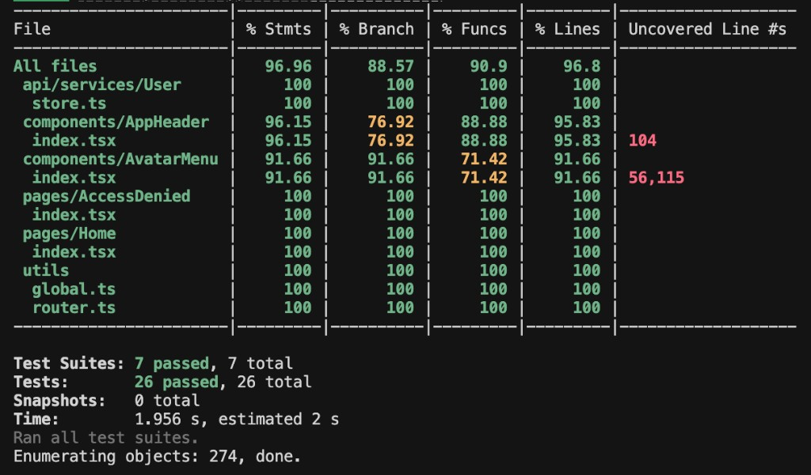

# Bug Bounty Challenge - Work Log

This README summarizes the changes implemented during the bug-bounty exercises, plus tooling upgrades (Node/React, linting, tests, hooks).

## 1) Original Bugs and Fixes

### Bug 1 - React list key warning

- **Issue:** `Each child in a list should have a unique "key" prop.`
- **Fix:** Added stable keys to the issue list in `src/pages/Home/index.tsx`:
  - `key={issue.key}` (before, no key on `<ListItem />`).

### Bug 2 - "known" should render bold (without changing i18n text)

- **Issue:** Intro text contained `<b>known</b>` in translation, but rendered as plain text.
- **Fix:** Switched to `Trans` from `react-i18next` in `src/pages/Home/index.tsx`:
  - `<Trans i18nKey="home.intro" ns="app" components={{ b: <b /> }} />`

### Bug 3 - Avatar missing in app bar

- **Issue:** User loaded but avatar not shown.
- **Root cause:** Typo in MobX store assignment.
- **Fixes:**
  - `src/api/services/User/store.ts`:
    - `this.urser = result` -> `this.user = result`
  - Hardened avatar derivation for partial data in `src/components/AvatarMenu/index.tsx`:
    - Null-safe initials and color derivation.

### Bug 4 - Countdown unstable / occasional glitches

- **Issues:** Interval cleanup missing, potential drift/negative countdown.
- **Fix:** `src/components/AppHeader/index.tsx`
  - Added interval cleanup in `useEffect`.
  - Bounded countdown at zero.
  - Integer-safe formatting (`MM:SS`).

### Bug 5 - Language switch (EN/DE)

- **Issue:** No language selector; German locale empty.
- **Fixes:**
  - Added EN/DE toggle in `src/components/AppHeader/index.tsx` via `i18n.changeLanguage(...)`.
  - Filled `src/i18n/locales/de.json` with German translations.
  - Moved list-item texts to i18n (`home.issues.*`) and translated EN/DE.

## 2) Additional Runtime/Console Fixes

### Transition/ref warning with `Grow`

- **Issue:** MUI `Grow` child must be able to hold refs.
- **Fix:** Wrapped `AvatarMenu` with a ref-capable wrapper (`<Box>`) inside `Grow` in `AppHeader`.

### Memory leak warning on unmounted component

- **Issue:** State updates after unmount.
- **Fix:** Proper interval cleanup in `AppHeader`.

### Parser/TypeScript compatibility errors

- **Issue:** Several parse errors caused by strict parser/toolchain behavior.
- **Fixes included:**
  - Removed fragile `as` assertions in problematic spots.
  - Moved MUI module augmentation to `src/themes/default/mui.d.ts`.
  - Simplified/adjusted typings in routing and utility code.
  - Ensured project builds successfully after fixes.

## 3) Node + Dependency Upgrade

## Node

- Updated `.nvmrc` to:
  - `node` (tracks latest stable via nvm).

## Core dependencies upgraded

- Updated React/tooling stack and aligned dependency compatibility:
  - `react` / `react-dom` -> `19.2.4`
  - `react-scripts` -> `5.0.1`
  - `@mui/material` / `@mui/styles` -> `5.18.0`
  - `notistack` -> `3.0.2`
  - `mobx` / `mobx-react` updated
  - `@emotion/*`, `@mdi/*`, etc. updated
  - `typescript` pinned to `4.9.5` (compatible with CRA 5)
  - Router kept at v5 (`react-router-dom@5.3.4`) because app currently uses v5 APIs (`Switch`, v5 route patterns).

## Code adjustments due to upgrades

- `src/index.tsx` migrated to React 19 root API:
  - `createRoot` from `react-dom/client`.
- React 19 typing updates:
  - Explicit `children` props where needed.
  - `JSX.Element` references replaced with `ReactElement` where required.
- `notistack` API update applied in `src/App.tsx`.

## 4) ESLint Setup

- Installed ESLint and config:
  - `.eslintrc.json` with `react-app` + `react-app/jest`.
- Added script in `package.json`:
  - `"lint": "eslint \"src/**/*.{ts,tsx}\""`

## 5) Test Setup and Coverage

## Testing dependencies and setup

- Added:
  - `@testing-library/react`
  - `@testing-library/jest-dom`
  - `@testing-library/user-event`
  - `@types/jest`
- Added `src/setupTests.ts` importing `@testing-library/jest-dom`.

## Created regression tests (non-barrel files with clear behavior)

- `src/utils/global.test.ts`
- `src/utils/router.test.ts`
- `src/api/services/User/store.test.ts`
- `src/pages/Home/index.test.tsx`
- `src/pages/AccessDenied/index.test.tsx`
- `src/components/AppHeader/index.test.tsx`
- `src/components/AvatarMenu/index.test.tsx`

These tests explicitly cover all original challenge bugs and prevent regressions.

## Coverage enforcement

- `npm test` configured to run once and exit:
  - `react-scripts test --env=jsdom --watchAll=false --coverage`
- Added Jest coverage config in `package.json`:
  - `collectCoverageFrom` scoped to meaningful runtime files.
  - Global coverage thresholds set to minimum **80%** for:
    - branches
    - functions
    - lines
    - statements

Current test run (latest):

- **Suites:** 7 passed
- **Tests:** 26 passed
- **Global coverage:** statements 96.96%, branches 88.57%, functions 90.9%, lines 96.8%

Coverage report screenshot:


## 6) Husky Hooks

- Installed `husky`.
- Added `prepare` script in `package.json`:
  - `"prepare": "husky"`
- Added pre-push hook:
  - `.husky/pre-push`
  - `npm run lint && npm test`

This blocks push on lint or test failures.

## 7) Commands

## Install

```bash
npm install
```

## Start app

```bash
npm start
```

## Build

```bash
npm run build
```

## Lint

```bash
npm run lint
```

## Test (single run with coverage)

```bash
npm test
```

## 8) Notes

- `react-router-dom` remains on v5 intentionally to avoid a routing refactor.
- Coverage is enforced on selected meaningful source files (non-barrel runtime paths), not generated/index barrel files.
